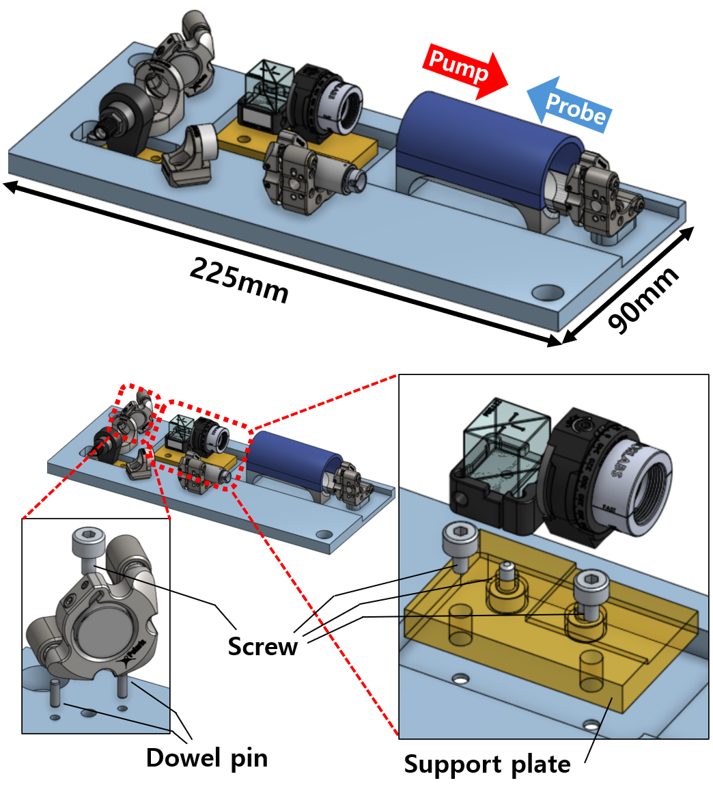
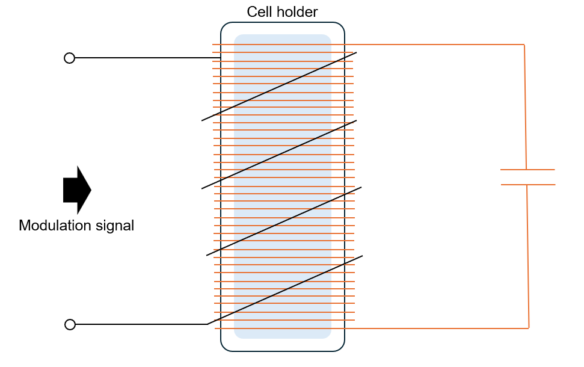

# 780nm Optical frequency reference Module Guideline 

In this project, we present a process of building a compact atomic optical frequency reference(AOFR) module with commerical, off-the shelf(COTS) optics. This device aims to provide precise and robust reference frequency source for wavelength meters, which is widely employed in optics laboratories. 

The entire system for laser frequency stabilization is integrated in 19" rack mountable case. 
In the module, the simple homemade optical block for saturated absorption spectroscopy(SAS) designed by web-based CAD, [Onshape](https://www.onshape.com/en/). The optical block designed using a beam-path-based methodology, in which each optical component is constrainted relative to the optical path to facilicate easy design modifications by user. 

Within the module, a Red Pitaya (STEMlab 125-14) perform PID locking and monitoring of the laser frequency.
By using user-friendly laser locking GUI [linien](https://github.com/linien-org/linien), user can easily control the entire system. 

All information of the design elements and COTS products is distributed via this page.

## Guideline 

### Overview 
The repository is organized into three parts:
- CAD files(.step, .stl) and drawings for custom subparts. 
- BOM list of COTS parts 
- DAG Metadata(.JSON file) of the SAS optics system. 

### Assemble and Installation 
---
1. Prepare the required subparts. Information of each components is available in the specified directory: 
    - COTS components 
        > .\AORF_module_BOM.xlsx
    - Base plate of optical block 
        > .\CAD drawings\SAS_plate\Machining_parts
    - Support base of optical components
        > .\CAD drawings\SAS_plate\3D_printed_parts
    - Enclousre 
        > .\CAD drawings\enclosure
2. Assemble the optical block, then connect the laser and verify that the spectroscopic signal.
    - Please refer to the following [Onshape link](https://cad.onshape.com/documents/0918872d287b7804801921a9/w/bc5e128b2e68215f23e08f09/e/3fa7893573c19a196d76a6ec) when assembling the block.
    - When verifing the signal with Redpitaya and linien, divide the photodiode output by using a bias tee before connecting to the device. For detail, refer to the [linien](https://github.com/linien-org/linien) documentation. 
    - If the spectroscopic signal exceed the measurement range, switch the jumper on the Redpitaya board to the HV. 
3. Once you have confirmed that the signal is present, configure the feedback loop using the Red Pitaya and Linien. In this case, the laser scan/mdoulation signal should be connected to the Koheron driver.
    - For the current modulation input on the Koheron driver, you can change the frequency range by adjusting the onboard jumper. For detail instructions, check the Koheron controller [User Guidline](https://www.koheron.com/support/user-guides/ctl200/).
4. If you configured the feedback loop in the previous step, the laser should be successfully locked. Integrate the system into the prepared enclosure, then verify once more that the spectroscopic signal is generated correctly. 
    - Please check the Onshape link and the "Optical Reference module" image below. 
5. If imporving lock quality of the module is required, Zeeman sublevel modulation can be employed instead of current modulation. See the "Zeeman sublevel modulation coil" section below. 

### Using the module 
---
At first run of the module, you need to setup a control PC. Install control GUI for each device:

| Device | GUI | connection | 
| ------ | --- | --- | 
| Laser controller | [CTL200 Graphical USer Interface](https://assets.koheron.com/gui/KoheronCTL200Setup0.4.0.exe) | Serial communication(USB) |  
| Redpitaya | [linien](https://github.com/linien-org/linien) | RJ45(LAN) | 

CTL200 also can be controlled directly by using serial communication. See [User Guidline](https://www.koheron.com/support/user-guides/ctl200/) of the device. Linien GUI and python client can be installed via PIP:

> pip install linien-gui

> pip install linien-client 

Overall status of the reference laser is controlled via CTL200 GUI. After turn on the laser, adjust the current setpoint to the specific laser power. Then, adjust the thermistor resistance setpoint to tune to the center frequency at the spectrosciopic signal appears. Ensure that the current scan via Redpitaya is enabled throughout this process. 

Further operation are performed by using linien. The tasks you can acrry out include the following:
- Frequency scan of the laser 
- Modulation signal configuration and frequeny Autolock. 
- Signal monitoring (Error, Feedback, Photodiode signal)
- Noise analysis (PSD)

See the [linien](https://github.com/linien-org/linien) page for instructions on setting up the GUI. 

## Remarks

### Optical Reference module scheme 

### Optical block 

- The optical block is the SAS optical system arranged along an optimized beam path within a 225 mm × 90 mm footprint. Optical componets are mounted by using M4 screws and 2.1mm dowel pins. Some subparts require 3D-printed(or CNC machined) supports. 

### Zeeman sublevel modulation coil(ZMC coil)

- To remove modulation frequency at the output laser frequency, modulation signal from the servo is applied to a solenoid which surrounded Rb cell and generate zeeman-sublevel modulation. 
- Rb atomic stretched state transition : **1.4MHz/Gauss**
- Wind enamel-coated wire around the cylindrical Rb cell holder to form a solenoid, then connect a capacitor across the solenoid's lead to config a LC circuit. 
    > Remark : Wind the coil with the Rb cell in place.
- Example of solenoid parameters:

    | Parameters | Values | 
    | ----- | --- | 
    | Wire thickness | 0.4mm |
    | Coil diameter | 28mm | 
    | Cell length | 50mm |
    | Number of turns | 120 | 
    | Capacitance | 100pF |
- You can sheiding magnetic field which generated at the solenoid by using mu-metal. 

## Reference 
[1] J. Wi, T. Kim, and J. Kim, "Compact and robust optical frequency reference module based on reproducible and redistributable optical design"
[2] B. Wiegand, B. Leykauf, R. Jördens, and M. Krutzik, “Linien: A versatile, user-friendly, open-source FPGA-based tool for frequency stabilization and spectroscopy parameter optimization,” Rev. Sci. Instruments 93, 063001 (2022).

## License 

## Disclaimer
The CAD representations of third-party components included in this material are the intellectual property of their respective owners and are provided here solely for reference and system integration purposes. We do not claim any copyright or ownership over these components. All rights remain with the respective rights holders.

## Acknowledgement  

This work was supported by the National Research Foundation of Korea (NRF) grant funded by the Korea government(MSIT) (2021R1F1A1062459,RS-2023-00302576,RS-2024-00466865
,2022M3H3A1063074) and Institute of Information \& Communications Technology Planning \& Evaluation (ITTP) grant funded by the Korean government(MSIT) (2022-0-01040).

